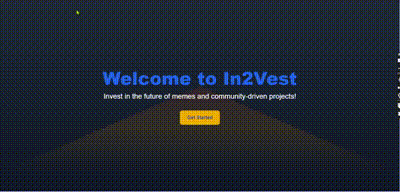
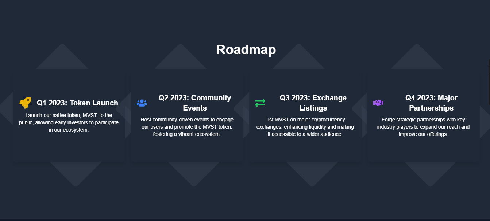

# In2Vest




**In2Vest is a comprehensive cryptocurrency investment tracking system that allows users to monitor their portfolios in real-time. With In2Vest, users can easily fetch, analyze, and manage various cryptocurrencies while receiving dynamic insights based on current market trends. The platform offers a user-friendly experience designed to empower both novice and expert investors to make informed decisions.**



## Table of Contents

- [Features](#features)
- [Technologies Used](#technologies-used)
- [Installation](#installation)
- [Usage](#usage)
- [API Reference](#api-reference)
- [Contributing](#contributing)
- [License](#license)

## Features

- **Real-time Cryptocurrency Data**: Fetch and display up-to-date prices and market data for a wide array of cryptocurrencies.
- **Portfolio Tracking**: Manage and track your cryptocurrency investments with detailed performance analysis.
- **Interactive and Responsive UI**: Built with a modern, responsive design for an intuitive user experience across devices.
- **Market Insights**: Get dynamic insights into market trends, helping users make better investment decisions.
- **Multi-Currency Support**: In2Vest supports multiple cryptocurrencies, including Bitcoin (BTC), Ethereum (ETH), and many others, with plans to support new tokens as they emerge.
- **Secure and Scalable**: Easily integrate with future functionalities such as account-based tracking and secure user data management.

## Technologies Used

### Frontend:
- **React.js**: A JavaScript library for building user interfaces.
- **Tailwind CSS**: A utility-first CSS framework for styling the frontend.
- **Axios**: A promise-based HTTP client for making API requests.

### Backend:
- **Node.js**: A JavaScript runtime built on Chrome's V8 engine for building scalable network applications.
- **Express.js**: A web framework for Node.js to create robust API services.
- **CoinGecko API**: Used to fetch live cryptocurrency data.

### Database (Optional):
- **MongoDB**: Used for storing user-specific data, such as portfolio information (optional but recommended for full functionality).

### Version Control:
- **Git**: For version control and collaboration.

## Installation

To set up the project on your local machine, follow the steps below:

1. **Clone the repository**:
   ```bash
   git clone https://github.com/yourusername/In2Vest.git
   ```

2. **Navigate to the project directory**:
   ```bash
   cd In2Vest
   ```

3. **Install dependencies**:
   - **Frontend**:
     ```bash
     cd client
     npm install
     ```
   - **Backend**:
     ```bash
     cd server
     npm install
     ```

4. **Configure Environment Variables**:
   - Create a `.env` file in the `server` directory and add the required environment variables for connecting to the CoinGecko API and MongoDB (if used). Example:
     ```
     COINGECKO_API_KEY=your_api_key_here
     MONGODB_URI=mongodb+srv://<username>:<password>@cluster0.mongodb.net/your_db?retryWrites=true&w=majority
     ```

5. **Run the development servers**:
   - **Frontend**:
     ```bash
     cd client
     npm start
     ```
   - **Backend**:
     ```bash
     cd server
     npm start
     ```

6. **Access the Application**:
   Open your browser and navigate to `http://localhost:3000` to access the frontend.

## Usage

1. Once the application is running, users can access the dashboard to track and manage their cryptocurrency portfolios.
2. Add cryptocurrencies to your portfolio by selecting tokens from the provided list.
3. View real-time price changes, portfolio performance metrics, and historical data for selected tokens.
4. Customize and manage your investment settings through the user interface.

## API Reference

### Fetch Cryptocurrency Data

- **Endpoint**: `GET /api/tokens`
- **Description**: Fetches a list of cryptocurrencies with real-time pricing information from CoinGecko.
- **Response**:
  ```json
  [
    {
      "id": "bitcoin",
      "symbol": "btc",
      "name": "Bitcoin",
      "current_price": 60776,
      "market_cap": 1145670000000,
      "price_change_percentage_24h": -2.34,
      "high_24h": 61200,
      "low_24h": 59000
    },
    ...
  ]
  ```

### Fetch Token Details

- **Endpoint**: `GET /api/tokens/:id`
- **Description**: Fetches detailed information for a specific cryptocurrency.
- **Parameters**: 
  - `id`: The unique ID of the cryptocurrency (e.g., `bitcoin`, `ethereum`).
- **Response**:
  ```json
  {
    "id": "bitcoin",
    "symbol": "btc",
    "name": "Bitcoin",
    "current_price": 60776,
    "market_cap": 1145670000000,
    "market_cap_rank": 1,
    "price_change_percentage_24h": -2.34,
    "high_24h": 61200,
    "low_24h": 59000,
    "circulating_supply": 18956250,
    "total_supply": 21000000
  }
  ```

### Additional API Endpoints

For additional API routes, ensure to document methods, parameters, and example responses for each. This could include features like user authentication, portfolio management, or historical data fetching.

## Contributing

We welcome contributions from the community! Follow these steps to contribute:

1. Fork the repository.
2. Create a new branch: `git checkout -b feature/YourFeature`.
3. Commit your changes: `git commit -m 'Add some feature'`.
4. Push to your branch: `git push origin feature/YourFeature`.
5. Open a Pull Request, detailing the changes you have made.

## License

This project is licensed under the MIT License. See the [LICENSE](LICENSE) file for more information.
